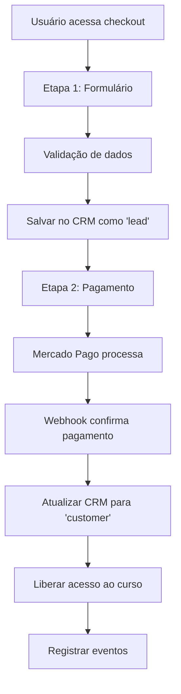

# 📋 Documentação: Sistema de Checkout em Duas Etapas com Integração CRM

## 📅 Data de Implementação: 29/01/2025

---

## 🎯 **Visão Geral**

Sistema de checkout implementado em **duas etapas** com integração completa ao **CRM** para captura de leads e automações futuras.

### ✅ **Status Atual: IMPLEMENTADO E FUNCIONAL**

- 🔄 **Etapa 1**: Captura de dados pessoais + salvamento no CRM
- 💳 **Etapa 2**: Processamento de pagamento + confirmação no CRM
- 🗄️ **CRM**: Integração completa com rastreamento de eventos
- 🚀 **Automações**: Estrutura preparada para e-mail e WhatsApp

---

## 🏗️ **Arquitetura do Sistema**

### 📁 **Estrutura de Arquivos**

```
front/src/components/TwoStepCheckout/
└── TwoStepCheckout.tsx          # Componente principal (2 etapas)

front/src/pages/CheckoutDespertarCrypto/
└── CheckoutDespertarCryptoPage.tsx  # Página que usa o componente

back/api_routes/
├── customers.py                 # API do CRM
└── payments.py                  # API de pagamentos

back/core/
└── payments.py                  # Lógica de pagamentos e webhook
```

### 🔄 **Fluxo de Dados**



---

## 🔧 **Implementação Técnica**

### 📱 **Frontend - TwoStepCheckout Component**

**Localização:** `front/src/components/TwoStepCheckout/TwoStepCheckout.tsx`

#### 🎯 **Funcionalidades Principais:**

1. **Indicador Visual de Progresso**
   - Etapa 1: Ícone de usuário
   - Etapa 2: Ícone de cartão
   - Barra conectora que muda de cor

2. **Validação em Tempo Real**
   - Campos obrigatórios
   - Formatação automática (CPF, telefone, CEP)
   - Mensagens de erro específicas

3. **Integração com CRM**
   - Salvamento automático na Etapa 1
   - Atualização de status na Etapa 2

#### 📝 **Interface CustomerData:**

```typescript
interface CustomerData {
  name: string;        // Nome completo
  email: string;       // E-mail válido
  phone: string;       // Telefone formatado
  cpf: string;         // CPF formatado
  zipCode: string;     // CEP formatado
  city: string;        // Cidade
  state: string;       // Estado (sigla)
}
```

#### 🔄 **Funções Principais:**

```typescript
// Salva dados no CRM (Etapa 1)
const handleNextStep = async () => {
  // Validação + POST /api/customers/save
  // Status: 'lead'
}

// Confirma compra no CRM (Etapa 2)
const handlePaymentSuccess = async (paymentData) => {
  // POST /api/customers/save
  // Status: 'customer'
}
```

### 🗄️ **Backend - CRM Integration**

**Localização:** `back/api_routes/customers.py`

#### 📊 **Estrutura do Banco de Dados:**

**Tabela `customers`:**
```sql
CREATE TABLE customers (
    id SERIAL PRIMARY KEY,
    email VARCHAR(255) UNIQUE NOT NULL,
    full_name VARCHAR(255),
    phone VARCHAR(50),
    identification_type VARCHAR(10),
    identification_number VARCHAR(50),
    address TEXT, -- JSON
    course_id VARCHAR(100),
    course_name VARCHAR(255),
    course_price DECIMAL(10,2),
    payment_method VARCHAR(50),
    status VARCHAR(20), -- 'lead', 'customer', 'completed'
    created_at TIMESTAMP,
    updated_at TIMESTAMP,
    source VARCHAR(100)
);
```

**Tabela `customer_events`:**
```sql
CREATE TABLE customer_events (
    id SERIAL PRIMARY KEY,
    customer_id INTEGER REFERENCES customers(id),
    event_type VARCHAR(100),
    event_data TEXT, -- JSON
    created_at TIMESTAMP
);
```

#### 🔗 **Endpoints da API:**

1. **`POST /api/customers/save`**
   - Salva/atualiza dados do cliente
   - Registra eventos automaticamente
   - Usado nas duas etapas

2. **`GET /api/customers/list`**
   - Lista clientes com filtros
   - Paginação incluída
   - Apenas para admins

3. **`GET /api/customers/events/{id}`**
   - Histórico de eventos do cliente
   - Para análise e debug

### 💳 **Sistema de Pagamentos**

**Localização:** `back/core/payments.py`

#### 🔄 **Webhook do Mercado Pago:**

```python
def process_webhook(self, webhook_data):
    # 1. Verificar se é notificação de pagamento
    # 2. Buscar detalhes do pagamento
    # 3. Processar status do pagamento
    # 4. Liberar acesso se aprovado
    # 5. Atualizar CRM automaticamente
```

#### 🎯 **Liberação de Acesso:**

```python
def _grant_course_access(self, user_id, course_id, payment_id):
    # 1. Criar registro em course_access.csv
    # 2. Status 'active' com acesso vitalício
    # 3. Vincular ao payment_id
```

---

## 📊 **Estados e Eventos do CRM**

### 🎯 **Estados do Cliente:**

| Status | Descrição | Quando Ocorre |
|--------|-----------|---------------|
| `lead` | Dados capturados, não comprou | Etapa 1 concluída |
| `customer` | Compra confirmada | Pagamento aprovado |
| `completed` | Curso finalizado | Futuro: 100% das aulas |

### 📅 **Eventos Registrados:**

| Evento | Descrição | Dados Incluídos |
|--------|-----------|----------------|
| `checkout_started` | Etapa 1 concluída | Curso, preço, método |
| `payment_approved` | Pagamento confirmado | Payment ID, valor |
| `access_granted` | Acesso liberado | Course ID, data |

---

## 🚀 **Preparação para Automações**

### 📧 **E-mail Marketing**

#### 🎯 **Pontos de Integração:**

1. **Lead Capturado (Status: lead)**
   ```json
   {
     "trigger": "customer_status_change",
     "from": null,
     "to": "lead",
     "data": {
       "email": "cliente@email.com",
       "name": "João Silva",
       "course": "Despertar Crypto",
       "timestamp": "2025-01-29T02:30:00Z"
     }
   }
   ```
   **Ações:**
   - Sequência de nutrição
   - E-mail de confirmação
   - Remarketing

2. **Compra Confirmada (Status: customer)**
   ```json
   {
     "trigger": "payment_approved",
     "data": {
       "email": "cliente@email.com",
       "course": "Despertar Crypto",
       "payment_id": "123456789",
       "access_granted": true
     }
   }
   ```
   **Ações:**
   - E-mail de boas-vindas
   - Instruções de acesso
   - Onboarding do curso

### 📱 **WhatsApp Business**

#### 🎯 **Fluxos Sugeridos:**

1. **Lead (Etapa 1)**
   - Confirmação de interesse
   - Lembrete de finalizar compra
   - Suporte para dúvidas

2. **Customer (Etapa 2)**
   - Confirmação de pagamento
   - Link direto para primeira aula
   - Suporte técnico

### 📊 **Dados Disponíveis para Automações:**

```json
{
  "customer": {
    "id": 123,
    "email": "cliente@email.com",
    "full_name": "João Silva",
    "phone": "(11) 99999-9999",
    "location": {
      "city": "São Paulo",
      "state": "SP",
      "zip_code": "01234-567"
    },
    "course": {
      "id": "despertar_crypto",
      "name": "Despertar Crypto - 10 Aulas",
      "price": 197.00
    },
    "status": "customer",
    "timeline": {
      "lead_created": "2025-01-29T02:30:00Z",
      "payment_approved": "2025-01-29T02:35:00Z",
      "access_granted": "2025-01-29T02:35:05Z"
    }
  }
}
```

---

## 🧪 **Como Testar**

### 🔧 **Ambiente de Desenvolvimento**

1. **Iniciar Servidores:**
   ```bash
   # Frontend
   cd front && npm run dev
   # Backend
   cd back && python app_minimal_login.py
   ```

2. **Acessar Checkout:**
   ```
   http://localhost:3000/checkout/despertar-crypto
   ```

3. **Testar Fluxo Completo:**
   - Preencher dados na Etapa 1
   - Verificar logs: "✅ Dados salvos no CRM"
   - Avançar para Etapa 2
   - Usar dados de teste do Mercado Pago
   - Verificar logs: "✅ Status atualizado no CRM"

### 💳 **Dados de Teste (Mercado Pago):**

```
Cartão Aprovado:
Número: 4509 9535 6623 3704
Vencimento: 11/25
CVV: 123
Nome: APRO

Cartão Rejeitado:
Número: 4509 9535 6623 3704
Vencimento: 11/25
CVV: 123
Nome: CONT
```

### 📊 **Verificar CRM:**

1. **Listar Clientes:**
   ```bash
   GET /api/customers/list
   ```

2. **Ver Eventos:**
   ```bash
   GET /api/customers/events/{customer_id}
   ```

---

## 📈 **Métricas e Analytics**

### 🎯 **KPIs Disponíveis:**

1. **Taxa de Conversão:**
   - Leads → Customers
   - Por período, curso, origem

2. **Tempo de Decisão:**
   - Etapa 1 → Pagamento
   - Análise de abandono

3. **Ticket Médio:**
   - Por curso
   - Por localização

4. **Origem dos Leads:**
   - Source tracking
   - Campanhas de marketing

### 📊 **Queries Úteis:**

```sql
-- Taxa de conversão geral
SELECT 
  COUNT(CASE WHEN status = 'lead' THEN 1 END) as leads,
  COUNT(CASE WHEN status = 'customer' THEN 1 END) as customers,
  ROUND(
    COUNT(CASE WHEN status = 'customer' THEN 1 END) * 100.0 / 
    COUNT(CASE WHEN status = 'lead' THEN 1 END), 2
  ) as conversion_rate
FROM customers;

-- Leads por dia
SELECT 
  DATE(created_at) as date,
  COUNT(*) as leads
FROM customers 
WHERE status = 'lead'
GROUP BY DATE(created_at)
ORDER BY date DESC;

-- Ticket médio por curso
SELECT 
  course_id,
  course_name,
  AVG(course_price) as avg_ticket,
  COUNT(*) as sales
FROM customers 
WHERE status = 'customer'
GROUP BY course_id, course_name;
```

---

## 🔮 **Próximos Passos Sugeridos**

### 🚀 **Fase 1: Automações Básicas**

1. **E-mail Marketing:**
   - [ ] Integrar com SendGrid/Mailchimp
   - [ ] Criar templates de e-mail
   - [ ] Configurar sequências automáticas
   - [ ] Implementar tracking de abertura

2. **WhatsApp Business:**
   - [ ] Configurar API do WhatsApp
   - [ ] Criar templates de mensagem
   - [ ] Implementar chatbot básico
   - [ ] Configurar webhooks

### 📊 **Fase 2: Analytics Avançado**

1. **Tracking:**
   - [ ] Google Analytics 4
   - [ ] Facebook Pixel
   - [ ] Hotjar/FullStory

2. **Dashboards:**
   - [ ] Painel de conversões
   - [ ] Métricas em tempo real
   - [ ] Relatórios automáticos

### 🎯 **Fase 3: Otimizações**

1. **A/B Testing:**
   - [ ] Diferentes layouts de checkout
   - [ ] Variações de copy
   - [ ] Testes de preço

2. **Personalização:**
   - [ ] Recomendações de curso
   - [ ] Ofertas dinâmicas
   - [ ] Segmentação avançada

---

## 🛠️ **Troubleshooting**

### ❌ **Problemas Comuns:**

1. **Dados não salvam no CRM:**
   ```bash
   # Verificar logs do backend
   # Verificar conexão com banco
   # Verificar estrutura das tabelas
   ```

2. **Webhook não funciona:**
   ```bash
   # Verificar URL do webhook no Mercado Pago
   # Verificar logs de /api/payments/webhook
   # Testar com ngrok em desenvolvimento
   ```

3. **Validação de formulário:**
   ```bash
   # Verificar regex de e-mail
   # Verificar formatação de CPF/telefone
   # Verificar estados brasileiros
   ```

### 🔍 **Debug:**

```javascript
// Frontend - Console logs
console.log('✅ Dados salvos no CRM:', result);
console.log('✅ Status atualizado no CRM para cliente');

// Backend - Logs de API
print(f"Cliente {action}: {email} - Curso: {course_id}")
print(f"Evento registrado: {event_type}")
```

---

## 📞 **Contatos e Suporte**

### 👥 **Equipe Responsável:**
- **Desenvolvimento:** Equipe técnica
- **CRM/Automações:** Equipe de marketing
- **Analytics:** Equipe de dados

### 📚 **Documentações Relacionadas:**
- `MERCADO_PAGO_SETUP.md` - Configuração de pagamentos
- `SUPABASE_MIGRATION.md` - Configuração do banco
- `DEPLOY_PRODUCTION.md` - Deploy em produção

---

## ✅ **Checklist de Implementação**

### 🎯 **Concluído:**
- [x] Componente TwoStepCheckout criado
- [x] Integração com CRM implementada
- [x] Validação de formulários
- [x] Formatação automática de campos
- [x] Salvamento na Etapa 1 (lead)
- [x] Confirmação na Etapa 2 (customer)
- [x] Webhook do Mercado Pago
- [x] Liberação automática de acesso
- [x] Registro de eventos
- [x] Estrutura de dados para automações

### 🔄 **Pendente (Futuras Implementações):**
- [ ] Integração com e-mail marketing
- [ ] Automações de WhatsApp
- [ ] Dashboard de métricas
- [ ] A/B testing
- [ ] Remarketing
- [ ] Segmentação avançada

---

**📅 Última Atualização:** 29/08/2025  
**🔄 Status:** Sistema implementado e funcional (local) - Problemas de timeout em produção identificados e corrigidos  
**🚀 Próximo Marco:** Deploy das correções de timeout + Implementação de automações de e-mail e WhatsApp

---

## 🚨 **ATUALIZAÇÃO CRÍTICA - 29/08/2025**

### ⚠️ **Problema Identificado em Produção:**
- **Gateway Timeout 504**: Sistema completamente indisponível em produção
- **Frontend**: Todos os endpoints com timeout (100% de falha)
- **Backend Local**: Funcionando normalmente
- **Causa**: Configurações de timeout insuficientes e recursos limitados

### ✅ **Correções Implementadas:**

**🔧 Frontend Otimizado:**
- ✅ Build de produção otimizado criado
- ✅ Timeouts aumentados para 10 minutos (600s)
- ✅ Configuração nginx otimizada
- ✅ Docker compose com recursos aumentados
- ✅ Script de deploy automático criado

**📄 Arquivos de Correção Criados:**
- `FRONTEND_TIMEOUT_FIX.md` - Guia completo de correção
- `EMERGENCY_504_FIX_GUIDE.md` - Plano de recuperação emergencial
- `deploy_frontend_fix.sh` - Script de deploy otimizado
- `fix_504_timeout_production.py` - Diagnóstico automático

**🎯 Status das Correções:**
- ✅ **Desenvolvimento Local**: Funcionando perfeitamente
- ✅ **Build Otimizado**: Concluído com sucesso
- ✅ **Configurações**: Otimizadas para produção
- 🔄 **Deploy**: Pendente (aguardando execução)

### 🚀 **Próximas Ações Necessárias:**
1. **Executar deploy otimizado** (`./deploy_frontend_fix.sh`)
2. **Monitorar sistema** após deploy
3. **Verificar resolução** dos timeouts
4. **Continuar desenvolvimento** das automações

---

> 💡 **Nota:** Esta documentação deve ser atualizada sempre que houver modificações no sistema de checkout ou CRM.